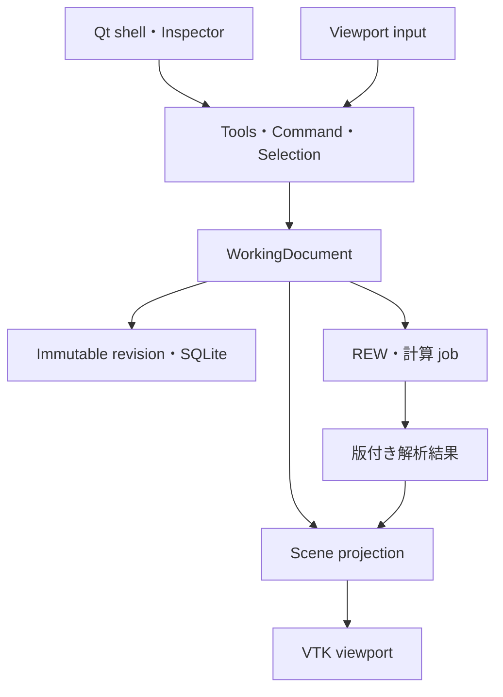

# HTDT 実装ロードマップ — CAD-first 正本

> 改訂: 2026-09-18 / N05〜N90・O10〜O80 software completion＋Issue #101 Deep Research bakeoff計画反映
> 対象: Windows 11 x64・個人利用
> **今後の実装順・milestone・受入条件の正本。計画上の成果を実装済みと扱わない。**

## 0. 決定と文書の関係

HTDTの中心を、mouseで部屋・スピーカー・座席・スクリーン・家具を直接構築し、測定・予測・配置候補を同じ空間で確認する3D CAD型editorにする。旧GUI、API、DB、ファイル形式の互換性は要件にしない。言語や過去の実装量より、操作品質と将来の実装・保守効率を優先する。

PySide6/Qt Widgets＋PyVista/VTK/PyVistaQtを第一実装方針として維持する。ただし、標準widgetでCAD操作が完成すると仮定しない。N05/N20の操作・配布gateを通過してから範囲を拡大する。根拠は[OSS調査](CAD_EDITOR_OSS_RESEARCH.md)、決定は[ADR-0001](adr/0001-native-cad-editor-stack.md)。

| 文書 | 正本とする内容 |
|---|---|
| 本書 | 実装順、依存、完了条件、移行 |
| [PROJECT_PLAN](PROJECT_PLAN.md) | 製品スコープと非目標 |
| [CAD_EDITOR_SPEC](CAD_EDITOR_SPEC.md) | 編集・保存・座標・形状・非同期処理の契約 |
| [UI_DESIGN](UI_DESIGN.md) | 操作と画面の設計 |
| [CAD_EDITOR_ACCEPTANCE](CAD_EDITOR_ACCEPTANCE.md) | fixture、手順、DPI/性能・実機gate |
| [ADR-0001](adr/0001-native-cad-editor-stack.md) / [OSS調査](CAD_EDITOR_OSS_RESEARCH.md) | 技術判断 / 読んだコードと採否 |
| [IMPLEMENTATION_STATUS](IMPLEMENTATION_STATUS.md) | main、branch、報告済みPoC、未検証の区別 |
| [DATA_AND_ANALYSIS](DATA_AND_ANALYSIS.md) / [MEASUREMENT_WORKFLOW](MEASUREMENT_WORKFLOW.md) | 不変測定・比較・REW連携契約 |
| [PLACEMENT_OPTIMIZATION_ROADMAP](PLACEMENT_OPTIMIZATION_ROADMAP.md) | 予測・最適化の算法詳細。作業順は本書に従う |
| [ACOUSTIC_SOLVER_RESEARCH_2026-09-18](ACOUSTIC_SOLVER_RESEARCH_2026-09-18.md) | Issue #101の数値手法/OSS調査、hybrid solver方針、R100〜R180の技術根拠 |
| [PLAN_REVIEW](PLAN_REVIEW.md) | 指摘・修正・検証記録 |

Issue/PRは本書を具体的な作業へ落とす追跡票とし、本書と矛盾する独立仕様にしない。仕様変更は対応する正本文書も同じPRで更新する。

旧文書のbrowser-first方針、旧v0.x実装順、PR #37内のfeature parity方針は本書で置換する。現行G00/G10/O10の実装契約と新Sceneの設計を混同しない。新Sceneへの変更はSPECと対応adapterで明示する。

## 1. 完成像と最初のrelease

中央のviewportでroom footprintを描き、頂点・壁・高さを編集し、paletteから物体を置く。gizmo、snap、寸法入力、Undo/Redoが同じ編集経路で動く。Top/Front/Side/Perspective、Scene tree、Inspectorは同じDocumentを扱う。

完成形は実測、配置制約、反射経路、予測場、多目的候補の比較へ進む。ただし、最初の**CAD foundation previewはN05〜N40＋最低限のpackage**で出せる。予測volumeや最適化完成を待たない。測定統合版はN60、最適化workspaceはモデルgateを満たしたN80として別に評価する。

## 2. 技術と境界

- Python 3.12 x64を最初の対象minorとする。無制限な3.12+の依存解決はしない。
- PySide6 / Qt Widgets、PyVista / VTK / PyVistaQt、Pydantic、SQLite、Shapely。
- NumPy、必要な計算からSciPy。FR dockはPyQtGraphをN60で評価。
- N05でWindows用の再現可能な依存lockと起動entry pointをcommitする。過去PoCの版はlockの代用にしない。
- 主GUIはnative application。自分自身へのHTTP、WebView、Node runtimeは必須にしない。
- domain/serviceはQt/VTK非依存。renderはGUI thread、長いI/O/計算は取消可能なjob。
- full CAD kernel、engine全体のfork、独自描画engineを初期に作らない。
- Issue #101の任意形状音響は、20–300 Hz wave acoustics＋中高域geometrical acousticsのhybridを基本とする。full-wave 20 Hz–20 kHzを標準経路にしない。
- solver correctnessはCPU baselineで成立させ、GPUはoptional acceleratorとする。CUDA/NVIDIAをprediction authorityへ埋め込まず、backend/device/resolutionをprovenanceへ保存する。
- 材料はgeometric用のbanded absorption/scatteringとwave用のcomplex impedance/admittanceを区別し、scalar吸音率から位相情報を無言で捏造しない。

詳細は[SPEC](CAD_EDITOR_SPEC.md)。SceneRevisionと測定Context、編集履歴と保存履歴、物理状態と表示状態を分離する。

## 3. Milestoneと依存

N番号は既存PRとの追跡用に維持する。N05を追加し、N20/N30を小さなsliceへ分ける。各行は小さなPRに分割できる。担当を自動的に増やす計画ではない。

| ID | 先行条件 | 成果 / 完了gate |
|---|---|---|
| N00 — 方針正本化 | なし | README・旧計画の矛盾を解消し、ADR・調査・受入へ到達可能。今回の文書改訂 |
| N05 — 技術の縦断試作 | N00 | GitHubのコード/lockだけから起動。F1でpick→drag→cancel/Undo→Save/reopen。standalone packageも試す。A01/A02 |
| N10 — editor shell / 保存 | N05 | QMainWindow、QtInteractor、Scene tree、Inspector、view切替、SceneRevision保存、復旧最小版。A03/A04 |
| N20a — 基本変形 | N10 | ToolController、CommandHistory、Move/Rotate、数値編集、grid/axis/angle snap。A05/A06 |
| N20b — CAD選択・snap | N20a | multi-select、vertex/edge/midpoint/alignment snap、pivot、入力競合解消。A07とDPI/性能 |
| N30a — room sketch | N20a、共通selection | 凹polygon作図・頂点挿入/削除/移動・高さ・寸法・bounds自動更新。A08 |
| N30b — wall / opening | N30a、N20b | 安定wall ID、開口、壁厚表示、壁変更とconstraint参照のtransaction。A09 |
| N40 — theater objects | N20b、N30b | speaker/seat/screen/furniture/AV機器/測定点、palette、duplicate、hide/lock、寸法。A10 |
| N50 — 制約の空間表示 | N40 | G10 adapter、allowed/exclusion、通路/離隔、壁選択、拒否理由overlay。A11 |
| N60 — 実測workspace | N40、保存契約 | REW読取/取込、SceneRevisionと測定点の対応、FR dock、過去配置ghost、比較。A12/A13 |
| N70 — 予測・可視化 | N50、入力版固定、対応model gate | modes/reflection、prediction layer、候補雲。場がある時だけheatmap/slice/volume。A13/A14、F5 |
| N80 — 最適化workspace | N50/N60/N70、O20〜O40の該当gate | SearchSpec編集、候補preview/適用、目的vector/Pareto比較、実測loop。A13/A14 |
| N90 — 安定release | 公開する機能のgate | installer/update、復元、性能、操作の仕上げ。A15。N70/N80は必須にしない |

N30aの単純頂点操作にN20b全機能は不要。N50とN60はN40後に独立して進められる。保存と配布の重大リスクはN90まで待たずN05/N10で確認する。

### Post-0.1 / R-series — arbitrary-room acoustics (Issue #101)

R-seriesはN05〜N90/O10〜O80の完成済みauthorityを置き換えず、その上に任意形状音響predictionを追加する。研究根拠と採否条件は[Arbitrary-room acoustics research](ACOUSTIC_SOLVER_RESEARCH_2026-09-18.md)を正本とする。

| ID | 先行条件 | 成果 / 完了gate |
|---|---|---|
| R100A — benchmark authority | N70 prediction authority | solver-neutral fixture contractを先に固定。AcousticRegion、Portal/BoundaryTermination、source/receiver、boundary/material、environment、expected observable、quantity-specific toleranceを定義。hard gateと性能比較を分離 |
| R100B — solver bakeoff / ADR | R100A | OSS既存FDTD CPU engine/adapterを優先評価し、独立FEM/reference・geometric referenceとrole別共通fixtureで比較。secondary候補の全実装は必須にしない。version/license/Windows/resource evidenceから採用またはno-go/次実験をADR化。新kernelは再利用不可の根拠がある場合のみ |
| R110 — acoustic authority / 入力・保存 | R100Bの採用gate通過・interface決定 | immutable AcousticSceneSnapshotとexact SceneRevisionに結ぶacoustic configuration。material/source/receiver/environment、隣接region・portal/terminationの入力と保存、Undo/Redo、既存Sceneの未設定状態を実装。semantic geometry hashとcompiled representation hashを分離 |
| R120 — geometry compiler | R110 | exact SceneRevision→canonical acoustic regions/surfaces/portals→wave grid / ray BVH / optional FEM mesh。compiler version/toleranceをprovenanceへ保存し、non-manifold/unintended-open/degenerate/thin unresolvedをfail-closed |
| R130A — rigid wave core | R120 | 20–300 Hz初期target。CPU correctness baseline、rigid analytical modes、FR/phase/IR/spatial field、convergence＋cross-solver gate |
| R130B — lossy boundary | R130A | 独立referenceを持つsimple impedance/admittance boundaryを追加し、reflection magnitude/phaseを検証 |
| R130C — frequency-dependent boundary | R130B | causal frequency-dependent boundary。time-domainではstability/passivity/causalityもacceptance対象 |
| R140 — hardware-aware execution | R130A以降 | R110/R130のidentity/stale/cancel/provenanceを維持したままCPU/GPU検出、RAM/VRAM estimate、candidate/solver二階層scheduler、oversubscription回避、efficient cache/resume、silent quality downgrade禁止 |
| R150 — geometric acoustics | R120 | direct/early specular、general-polyhedral ray tracing、banded absorption/scattering、source directivity、deterministic seed/provenance。diffractionは独立fixture成立時のみ追加 |
| R160 — typed hybrid broadband | 使用する境界capabilityのR130A/B/C gate + R150 + 有効overlap | CoherentTransfer / DeterministicPathSet / LateEnergyDecayを区別し、explicit overlap/crossoverと共有成分のdouble-counting防止を実装。unsupported phase/metricを生成しない |
| R170A — low-band integration | R110/R120 + 使用境界capabilityのR130 gate + 既存O-series | typed result provider→N70表示→bounded CPU batch→O30/O40→O50→N60/O60。基本cancel/cache/resumeとO70 authority bindingを維持。R140/R150/R160や適応探索完成を前提にしない |
| R180A — low-band validation | R170A + 対象数値gate | source/playback/receiver/time referenceを揃えた低域campaign。calibration後のmodel/config hashを固定し独立holdoutでFR目的を検証。合格しても未検証phase/IR/広帯域/aimへ拡張しない |
| R170B — hybrid / extended integration | R170A + R140/R160 + 使用O70/O80 capability | multi-fidelity・hybrid batch、O70残差/適応、O80多席/多音源/aimを対応契約付きで追加。reuse・screening gateを適用 |
| R180B — additional validation | R170B + 対象数値gate | hybrid/decay/phase/directional等の追加claimごとに測定adapter・許容差・独立holdoutを検証。旧RoomSim/R180A合格を流用しない |

R100はumbrellaとし、先にR100Aでsolver-neutral fixture authorityを作り、その後R100Bでsolverを比較する。各solver専用の仮geometry/開口/material定義を先に作って比較しない。openingは「壁の穴」だけでは不十分で、explicit adjacent AcousticRegionまたはBoundaryTerminationを持つ。未知の隣接空間を無言でanechoic/absorbingとみなさない。

R100Bでは「候補ライブラリを先に製品依存へ固定」しない。FDTD-firstは評価順であり自作kernel必須ではない。既存engine→adapter/port→不足部分の自作を比較するが、staircase/thin-surface/material-boundary精度またはWindows packagingがgate未達なら、MFEM等のFEM pathを同じR100A fixtureで比較して決める。BEM/FMM、DG/high-order FEM、PSTD/k-spaceはsecondary/reference候補とし、初期production dependencyにはしない。

共通fixtureは最低限、rigid rectangular analytical modes、grid/mesh convergence、単一impedance/reflection boundary、L字/凹room、region-to-region portalまたは明示termination、counter相当のreflecting obstacle、direct path、first reflection、seed repeatability、hybrid overlap continuityを含む。points/elements-per-wavelength等の経験則は初期値に使えてもacceptanceそのものにはせず、backendごとの収束測定からvalid upper frequencyを決める。license/redistribution、Windows再現性、必要physics capability、CPU correctness等のhard gateを通過した候補だけを速度・memory・実装複雑度で比較する。

R100で**確定してよい**のは hybrid/multi-fidelity architecture、CPU correctness baseline、材料authority分離、receiver/environment authority、immutable provenance、O60 real-data gateである。production wave library、最終crossover、GPU vendor/API、mesh/grid preset、FEM mesher/linear-solver stack、diffraction/late-field方式はbenchmark前に固定しない。研究報告中の一般的GPU speedup値や単一ハードウェア例をHTDTの性能要件へ直接転記しない。

### Issue #101を満たす順序と範囲

最短の実用検証経路は **R100A→R100B採用→R110/R120→必要なR130 boundary gate→R170A→R180A**。低域の配置比較を実室で確かめるために、GPU高度化・幾何音響・広帯域hybridの完成を待たない。R140/R150以降を別経路で進め、追加能力をR170B/R180Bで評価する。R170/R180はA/Bをまとめるumbrella IDとして維持する。

現行O60は `cad_model_validation_service.py` でRoomSim attemptを読んでおり、campaignはFRの4 objectiveを受け入れる。R170Aにtyped prediction-result provider/adapterとO20/O30/O50/O60/O70のbinding変更を明示し、新solverを偽のRoomSim attemptに格納しない。既存record/adapterを保ち、新observableは独立gateで追加する。

R100Aの成果物はfixture一覧だけではない。対象room/隣接容積、帯域、source/receiver数、時間長、candidate workload、CPU/RAM/disk budgetと許容誤差・compile/solve/postprocess時間の判定値をmanifestへ固定する。R100Bは値を測定して採否を判断し、不合格ならno-go/次の限定実験を記録する。このレビューで未測定の実機性能を保証しない。

| Issue #101の要件 | 担当gate | 完了の証拠 |
|---|---|---|
| Acceptance 1–4: 非矩形・開口・材料による物理変化 | R100A/B、R120、R130、R150 | 独立reference、portal分割不変性/開閉、係数・energy balance、感度fixture |
| Acceptance 5–6, 8: provenance/stale/evidence区分 | R110、R130、R170A | 保存/再open・異なるhash/遅延結果の拒否・synthetic昇格拒否 |
| Acceptance 7, 9: batch/owned-room推薦 | R170A/B、R180A/B | typed adapter、対象帯域/observable限定のcampaign/holdout |
| Acceptance 10: native 3D可視化 | R170A、R150/R160/R170B | 低域fieldと後続reflectionのrevision付きoverlay受入 |
| Acceptance 11–17: hardware/parallelism/cache | R140、R170B | CPU必須、該当GPU backendの数値/resource/fallback、resume evidence |
| 本文の広帯域・directivity/O80・校正 | R150/R160/R170B/R180B | valid-band/result capability、playback/reference、calibration/holdoutと追加metric検証 |

低域sliceの合格だけでIssue #101全体をcloseしない。CPU-only機でGPU比較が対象外であることと、選定したGPU backendの検証未完了を区別し、未対応形状・指標・帯域は未完了範囲として残す。

### R-series追加受入契約（2026-09-18）

詳細は[研究文書 §4D–§10](ACOUSTIC_SOLVER_RESEARCH_2026-09-18.md#4d-plan-re-review-benchmark-authority-before-solver-bakeoff)。

- **工程**: 次の実装はR100Aのfixture/observable/tolerance manifest。R100Bは適用対象PoCの比較までとし、後続の製品GUI・scheduler・hybridの完成を前提にしない。shipping candidateのWindows/CPU gateと、別環境でも再現可能な独立referenceを区別する。GPU未搭載はGPU比較のみ対象外。
- **数値比較**: source単位・正規化、座標・補間、phase/Fourier符号、時間原点、dt/周波数刻み、観測時間、精度、window/filter、reference・許容差を固定する。無損失閉室の固有モードと、共振点の有限FR/RT60を混同しない。FR/phaseは成立する損失条件または有限時間処理を揃え、null付近の位相・相対誤差をmaskする。
- **製品入力**: 現行CADは単一RoomPrismであり、複数regionの編集済みとは扱わない。R110/R120の初期対応を凹prism・対応object・隣接prism/terminationへ明示限定し、傾斜/曲面等は別gateまでunsupported。material割当・隣接空間・boundaryをGUIで入力し、保存/再open、Undo/Redo、staleを検証する。
- **物体の意味**: hide/lockとacoustic participationを分ける。speaker cabinetを反射体として含む場合は移動/回転でgeometryを更新し、密閉cabinet内部の点音源やdirectivityとの二重計上を無検証で許さない。
- **帯域・指標**: wave/GAの検証済み帯域が重ならなければgapを残し、広帯域IRやcoherent phaseを生成しない。経路だけで複素応答を認めず、reflection/source/timing authorityを要求。RT60/EDT/C50/C80はfilter・時間原点・tail/fit条件を保存し、打切り/減衰不足を判定する。
- **計算資源**: R100B CPU PoCからRAM/出力容量・実行長の上限を設け、R110/R130で取消・staleを保持する。全空間×全時刻のfield保存を既定にしない。R140のCPU fallbackも再見積りし、OOMや無断出力縮小を避ける。
- **最適化**: reuseはoperator不変を検証し、物体移動/回転・材料変更で必要なcacheを失効する。粗計算の誤差/順位逆転・除外候補auditを検証し、未対応値を悪いscoreに置換しない。最終Paretoは同一fidelity・帯域・objective条件で再評価する。

R100A〜R180の実装・数値benchmark・owned-room validationは、この文書改訂によって完了したことにはならない。

### N05 / N10の実装slice

1. 旧ContextDraftと別に最小Scene/WorkingDocumentを作り、sampleを表示する。
2. entity ID→actor対応と単一selectionを実装し、treeとInspectorを同期する。
3. 1つのspeakerの移動を同じcommandからmouse/Inspectorで行い、cancel/Undoを成立させる。
4. SceneRevisionのSave/reopenとclean判定を実装する。
5. Windows entry point、依存lock、standalone packageをPRから再現する。
6. 以上の実機結果を残してN20へ進む。PoCがローカルにしかない状態で完了にしない。

N05のために一般plugin frameworkや全entity型を実装しない。N10で復旧・複数projectの扱い等を拡張する。

### N20の完了条件

- 1 drag=1 Undo、no-op/cancelは履歴に残らない。
- Esc/capture loss/Alt+Tab/画面外releaseが操作残留を起こさない。
- 同じ結果をmouse/数値で入力できる。未知aimは移動で既知にならない。
- camera操作、object変形、textbox shortcutが競合しない。
- snap半径はDPI/zoomに応じた画面距離で選択し、幾何toleranceと分離する。
- 複数物体の相対配置と共通pivotを保つ。
- A05〜A07を満たし、SPECのVTK callback対策を実機で確認する。

### N30 / N40の完了条件

- 長文説明や座標表なしでL字室と3.0.2配置を作れる。
- 作図はTop viewへ自然に切り替わり、3Dで即座に高さ・干渉を確認できる。
- 壁分割/結合で開口や壁制約を取り違えず、Undoで全参照を戻せる。
- 家具のpose/寸法と音響基準点を区別する。
- hide/lockは測定条件を変更しない。
- N05のpackageを更新して同じsceneを保存・再openできる。
- 初見操作記録で、迷う導線を直す。外観だけで完了にしない。

### N70 / N80と算法側の対応

| editor側 | 算法側 | 条件 |
|---|---|---|
| N50 | G00/G10（現行実装あり） | new Sceneからのadapterとwall参照を検証 |
| N80の候補preview最小部 | O10（現行実装あり） | 順位を付けず幾何的候補として表示 |
| N70の予測結果表示 | S01等のmodel＋O20 / R130〜R160 | source revision、適用形状/帯域、材料/source/solver/backend provenance、再現性、取消を満たす |
| N80のPareto比較 | O30/O40 | 目的vector・制約を維持。音質総合点にしない |
| N80の実測loop / 推薦 | O50/O60、必要ならO70 | 独立した実測検証前に自動推薦へ昇格しない |

開発・受入ではsynthetic fixtureによるO70/O80 end-to-endを許可する。ただし、synthetic結果は`development_synthetic`として明示し、owned-room evidenceとして保存・表示・production推薦へ昇格しない。これにより物理測定を待たずソフトウェア実装を完成できる一方、実室妥当性gateは独立して維持する。

GUI上で非矩形室を編集できても、REW Room Simulatorやgeometrical-acoustics-only modelが非矩形室の低域wave behaviorを正確に予測できることにはならない。REWはrectangular baseline、pyroomacoustics等はgeometric PoC/referenceとして扱い、R130のwave authorityと混同しない。解析layerは実測/予測/仮説と入力revisionを表示し、編集で古くなった結果をstaleにする。

## 4. 実装資産・切替

再利用候補はREW adapter、RawAsset、比較数式、SQLiteの不変保存、G00/G10/O10の幾何・探索。現行Pydantic/API payloadやbrowser stateを新Documentの正本にしない。

新project schemaは旧DBと分けて始められる。旧APIの互換adapter、全データmigration、browserとの機能同等性は義務にしない。測定原本/保存済み履歴を保持し、明示importだけを必要に応じ追加する。

browser UIは機能凍結し、新しいCAD機能を二重実装しない。N40のCAD previewでは旧版が測定確認用に残ってもよい。N60のnative測定経路が受け入れられたら、不要なfrontend/FastAPI配信/Node buildを通常起動とCIから外すPRを作る。削除範囲と実データの扱い、rollbackを明記する。

## 5. 選定の再評価

第一候補を採用する理由はPython解析と科学可視化の統合コストであり、「WebだからCAD不可」「Godotならeditorがそのまま製品になる」ではない。

N05/N20で根本的な操作・DPI・配布問題が残る場合、一回の改善slice後に同じF1/F4・A01/A02/A05〜A07で代替を比較する。原因に応じてQt＋別interaction層、Godot runtime、C#＋Helix Toolkit、TypeScript＋Three.js/Babylon＋desktop shellから必要な候補を選ぶ。全部を並行実装しない。

速度・操作誤り・配布・Python境界・実装量を記録し、判断が変わったらADRを更新する。既存言語への固執も、未計測の性能を理由にした全面rewriteもしない。

## 6. 検証とGitHub運用

- 可逆・低影響変更へ機械的にtestを増やさない。必要な保存・Undo・座標・形状・版参照の不変条件だけ自動化する。
- GUIの実機gateとCIを分ける。Windows/GPU未確認なら未確認と記録する。
- 各PRへmilestone、実装範囲、参考OSSのcommit/path/license、検証結果、既知制限、次工程を残す。
- domain/adapterの追加時に対応する仕様とstatusを同じPRで更新する。
- 作業正本はGitHub。所有PCの `C:\Users\ka092\Desktop\HTDT\` は必要な実機検証に使い、不要な一時物は残さない。

## 7. 現在の追跡先

2026-09-18時点で、CAD-first roadmapのN05〜N90と配置最適化software pathのO10〜O80はmainへ実装済み。O70はPR #92/#93、O80はPR #94で完了し、PR #94 merge `6faf554bcf3670f64ff13c530fa4fc79ab1881b8` をCI #548 / run `35313405578` とWindows Release Artifact #93 / run `35313405629` がPASSした。

Issue #90のsynthetic software-completion laneは完了。real-repository fixtureでScene→Search→prediction→Measurement Plan→synthetic measurement→Objective→O60→O70→O80を通し、packaged executableからのseedも検証済み。synthetic evidenceは `synthetic_fixture` / `physical_measurement=false` のまま保持し、production authorityへ昇格しない。

現行O10〜O80 modelをproduction-owned-roomへ昇格させる未完了gateは [Issue #83 — O60R owned-room campaign execution / hardware evidence](https://github.com/bolph71656-ai/Home-Theater-Digital-Twin/issues/83)。これはsoftware実装ではなく、実際のspeaker/setup移動とREW測定を伴う実室model validationである。eligible campaign-backed owned-room ValidationRecordとO60R audit PASSが成立するまで、O70 `production_owned_room` recommendationとO80 owned-room directional capabilityはfail-closedを維持する。

新規software feature trackとして [Issue #101 — arbitrary-room hybrid acoustics](https://github.com/bolph71656-ai/Home-Theater-Digital-Twin/issues/101) と [Issue #102 — GUI backup/restore/migration](https://github.com/bolph71656-ai/Home-Theater-Digital-Twin/issues/102) がopen。#101はR100〜R180として本書へ組み込み、#83の実測gateを迂回しない。#102はN90 backup authorityを再利用するUI改善であり、archive semanticsを二重実装しない。

旧Issue #41等の初期milestoneは履歴としてclose済みであり、今後の再開点として扱わない。追加機能を実装する場合は、この完成済みmainを起点に新しいIssue/PRを作り、既存authority契約を弱めない。
