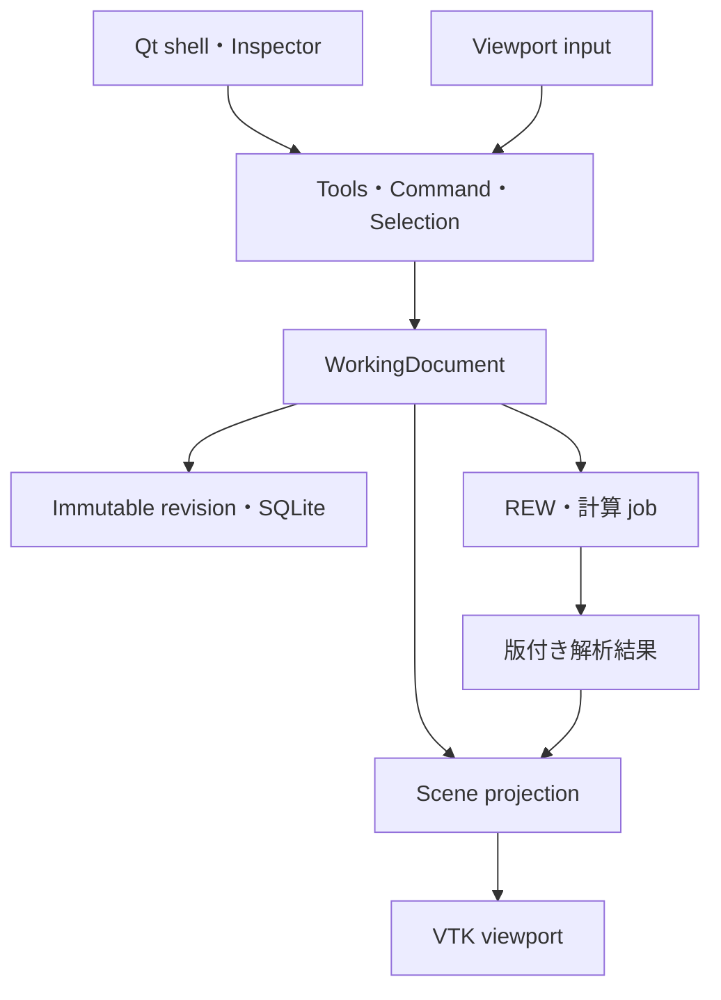

# HTDT 実装ロードマップ — CAD-first 正本

> 改訂: 2026-09-16 / ソースレビュー後の改訂
> 対象: Windows 11 x64・個人利用
> **今後の実装順・milestone・受入条件の正本。計画上の成果を実装済みと扱わない。**

## 0. 決定と文書の関係

HTDTの中心を、mouseで部屋・スピーカー・座席・スクリーン・家具を直接構築し、測定・予測・配置候補を同じ空間で確認する3D CAD型editorにする。旧GUI、API、DB、ファイル形式の互換性は要件にしない。言語や過去の実装量より、操作品質と将来の実装・保守効率を優先する。

PySide6/Qt Widgets＋PyVista/VTK/PyVistaQtを第一実装方針として維持する。ただし、標準widgetでCAD操作が完成すると仮定しない。N05/N20の操作・配布gateを通過してから範囲を拡大する。根拠は[OSS調査](CAD_EDITOR_OSS_RESEARCH.md)、決定は[ADR-0001](adr/0001-native-cad-editor-stack.md)。

| 文書 | 正本とする内容 |
|---|---|
| 本書 | 実装順、依存、完了条件、移行 |
| [PROJECT_PLAN](PROJECT_PLAN.md) | 製品スコープと非目標 |
| [CAD_EDITOR_SPEC](CAD_EDITOR_SPEC.md) | 編集・保存・座標・形状・非同期処理の契約 |
| [UI_DESIGN](UI_DESIGN.md) | 操作と画面の設計 |
| [CAD_EDITOR_ACCEPTANCE](CAD_EDITOR_ACCEPTANCE.md) | fixture、手順、DPI/性能・実機gate |
| [ADR-0001](adr/0001-native-cad-editor-stack.md) / [OSS調査](CAD_EDITOR_OSS_RESEARCH.md) | 技術判断 / 読んだコードと採否 |
| [IMPLEMENTATION_STATUS](IMPLEMENTATION_STATUS.md) | main、branch、報告済みPoC、未検証の区別 |
| [DATA_AND_ANALYSIS](DATA_AND_ANALYSIS.md) / [MEASUREMENT_WORKFLOW](MEASUREMENT_WORKFLOW.md) | 不変測定・比較・REW連携契約 |
| [PLACEMENT_OPTIMIZATION_ROADMAP](PLACEMENT_OPTIMIZATION_ROADMAP.md) | 予測・最適化の算法詳細。作業順は本書に従う |
| [PLAN_REVIEW](PLAN_REVIEW.md) | 指摘・修正・検証記録 |

旧文書のbrowser-first方針、旧v0.x実装順、PR #37内のfeature parity方針は本書で置換する。現行G00/G10/O10の実装契約と新Sceneの設計を混同しない。新Sceneへの変更はSPECと対応adapterで明示する。

## 1. 完成像と最初のrelease

中央のviewportでroom footprintを描き、頂点・壁・高さを編集し、paletteから物体を置く。gizmo、snap、寸法入力、Undo/Redoが同じ編集経路で動く。Top/Front/Side/Perspective、Scene tree、Inspectorは同じDocumentを扱う。

完成形は実測、配置制約、反射経路、予測場、多目的候補の比較へ進む。ただし、最初の**CAD foundation previewはN05〜N40＋最低限のpackage**で出せる。予測volumeや最適化完成を待たない。測定統合版はN60、最適化workspaceはモデルgateを満たしたN80として別に評価する。

## 2. 技術と境界

- Python 3.12 x64を最初の対象minorとする。無制限な3.12+の依存解決はしない。
- PySide6 / Qt Widgets、PyVista / VTK / PyVistaQt、Pydantic、SQLite、Shapely。
- NumPy、必要な計算からSciPy。FR dockはPyQtGraphをN60で評価。
- N05でWindows用の再現可能な依存lockと起動entry pointをcommitする。過去PoCの版はlockの代用にしない。
- 主GUIはnative application。自分自身へのHTTP、WebView、Node runtimeは必須にしない。
- domain/serviceはQt/VTK非依存。renderはGUI thread、長いI/O/計算は取消可能なjob。
- full CAD kernel、汎用solver、engine全体のfork、独自描画engineを初期に作らない。

詳細は[SPEC](CAD_EDITOR_SPEC.md)。SceneRevisionと測定Context、編集履歴と保存履歴、物理状態と表示状態を分離する。

## 3. Milestoneと依存

N番号は既存PRとの追跡用に維持する。N05を追加し、N20/N30を小さなsliceへ分ける。各行は小さなPRに分割できる。担当を自動的に増やす計画ではない。

| ID | 先行条件 | 成果 / 完了gate |
|---|---|---|
| N00 — 方針正本化 | なし | README・旧計画の矛盾を解消し、ADR・調査・受入へ到達可能。今回の文書改訂 |
| N05 — 技術の縦断試作 | N00 | GitHubのコード/lockだけから起動。F1でpick→drag→cancel/Undo→Save/reopen。standalone packageも試す。A01/A02 |
| N10 — editor shell / 保存 | N05 | QMainWindow、QtInteractor、Scene tree、Inspector、view切替、SceneRevision保存、復旧最小版。A03/A04 |
| N20a — 基本変形 | N10 | ToolController、CommandHistory、Move/Rotate、数値編集、grid/axis/angle snap。A05/A06 |
| N20b — CAD選択・snap | N20a | multi-select、vertex/edge/midpoint/alignment snap、pivot、入力競合解消。A07とDPI/性能 |
| N30a — room sketch | N20a、共通selection | 凹polygon作図・頂点挿入/削除/移動・高さ・寸法・bounds自動更新。A08 |
| N30b — wall / opening | N30a、N20b | 安定wall ID、開口、壁厚表示、壁変更とconstraint参照のtransaction。A09 |
| N40 — theater objects | N20b、N30b | speaker/seat/screen/furniture/AV機器/測定点、palette、duplicate、hide/lock、寸法。A10 |
| N50 — 制約の空間表示 | N40 | G10 adapter、allowed/exclusion、通路/離隔、壁選択、拒否理由overlay。A11 |
| N60 — 実測workspace | N40、保存契約 | REW読取/取込、SceneRevisionと測定点の対応、FR dock、過去配置ghost、比較。A12/A13 |
| N70 — 予測・可視化 | N50、入力版固定、対応model gate | modes/reflection、prediction layer、候補雲。場がある時だけheatmap/slice/volume。A13/A14、F5 |
| N80 — 最適化workspace | N50/N60/N70、O20〜O40の該当gate | SearchSpec編集、候補preview/適用、目的vector/Pareto比較、実測loop。A13/A14 |
| N90 — 安定release | 公開する機能のgate | installer/update、復元、性能、操作の仕上げ。A15。N70/N80は必須にしない |

N30aの単純頂点操作にN20b全機能は不要。N50とN60はN40後に独立して進められる。保存と配布の重大リスクはN90まで待たずN05/N10で確認する。

### N05 / N10の実装slice

1. 旧ContextDraftと別に最小Scene/WorkingDocumentを作り、sampleを表示する。
2. entity ID→actor対応と単一selectionを実装し、treeとInspectorを同期する。
3. 1つのspeakerの移動を同じcommandからmouse/Inspectorで行い、cancel/Undoを成立させる。
4. SceneRevisionのSave/reopenとclean判定を実装する。
5. Windows entry point、依存lock、standalone packageをPRから再現する。
6. 以上の実機結果を残してN20へ進む。PoCがローカルにしかない状態で完了にしない。

N05のために一般plugin frameworkや全entity型を実装しない。N10で復旧・複数projectの扱い等を拡張する。

### N20の完了条件

- 1 drag=1 Undo、no-op/cancelは履歴に残らない。
- Esc/capture loss/Alt+Tab/画面外releaseが操作残留を起こさない。
- 同じ結果をmouse/数値で入力できる。未知aimは移動で既知にならない。
- camera操作、object変形、textbox shortcutが競合しない。
- snap半径はDPI/zoomに応じた画面距離で選択し、幾何toleranceと分離する。
- 複数物体の相対配置と共通pivotを保つ。
- A05〜A07を満たし、SPECのVTK callback対策を実機で確認する。

### N30 / N40の完了条件

- 長文説明や座標表なしでL字室と3.0.2配置を作れる。
- 作図はTop viewへ自然に切り替わり、3Dで即座に高さ・干渉を確認できる。
- 壁分割/結合で開口や壁制約を取り違えず、Undoで全参照を戻せる。
- 家具のpose/寸法と音響基準点を区別する。
- hide/lockは測定条件を変更しない。
- N05のpackageを更新して同じsceneを保存・再openできる。
- 初見操作記録で、迷う導線を直す。外観だけで完了にしない。

### N70 / N80と算法側の対応

| editor側 | 算法側 | 条件 |
|---|---|---|
| N50 | G00/G10（現行実装あり） | new Sceneからのadapterとwall参照を検証 |
| N80の候補preview最小部 | O10（現行実装あり） | 順位を付けず幾何的候補として表示 |
| N70の予測結果表示 | S01等のmodel＋O20 | source revision、適用形状/帯域、再現性、取消を満たす |
| N80のPareto比較 | O30/O40 | 目的vector・制約を維持。音質総合点にしない |
| N80の実測loop / 推薦 | O50/O60、必要ならO70 | 独立した実測検証前に自動推薦へ昇格しない |

GUI上で非矩形室を編集できても、REW Room Simulatorが非矩形を正確に予測できることにはならない。解析layerは実測/予測/仮説と入力revisionを表示し、編集で古くなった結果をstaleにする。

## 4. 実装資産・切替

再利用候補はREW adapter、RawAsset、比較数式、SQLiteの不変保存、G00/G10/O10の幾何・探索。現行Pydantic/API payloadやbrowser stateを新Documentの正本にしない。

新project schemaは旧DBと分けて始められる。旧APIの互換adapter、全データmigration、browserとの機能同等性は義務にしない。測定原本/保存済み履歴を保持し、明示importだけを必要に応じ追加する。

browser UIは機能凍結し、新しいCAD機能を二重実装しない。N40のCAD previewでは旧版が測定確認用に残ってもよい。N60のnative測定経路が受け入れられたら、不要なfrontend/FastAPI配信/Node buildを通常起動とCIから外すPRを作る。削除範囲と実データの扱い、rollbackを明記する。

## 5. 選定の再評価

第一候補を採用する理由はPython解析と科学可視化の統合コストであり、「WebだからCAD不可」「Godotならeditorがそのまま製品になる」ではない。

N05/N20で根本的な操作・DPI・配布問題が残る場合、一回の改善slice後に同じF1/F4・A01/A02/A05〜A07で代替を比較する。原因に応じてQt＋別interaction層、Godot runtime、C#＋Helix Toolkit、TypeScript＋Three.js/Babylon＋desktop shellから必要な候補を選ぶ。全部を並行実装しない。

速度・操作誤り・配布・Python境界・実装量を記録し、判断が変わったらADRを更新する。既存言語への固執も、未計測の性能を理由にした全面rewriteもしない。

## 6. 検証とGitHub運用

- 可逆・低影響変更へ機械的にtestを増やさない。必要な保存・Undo・座標・形状・版参照の不変条件だけ自動化する。
- GUIの実機gateとCIを分ける。Windows/GPU未確認なら未確認と記録する。
- 各PRへmilestone、実装範囲、参考OSSのcommit/path/license、検証結果、既知制限、次工程を残す。
- domain/adapterの追加時に対応する仕様とstatusを同じPRで更新する。
- 作業正本はGitHub。所有PCの `C:\Users\ka092\Desktop\HTDT\` は必要な実機検証に使い、不要な一時物は残さない。

## 7. PR #37と現在地

[Draft PR #37](https://github.com/bolph71656-ai/Home-Theater-Digital-Twin/pull/37)を最初の実装trackとして継続する。初回レビューheadは `9724f4b`、追加確認headは `0353768`。

同branchの `spatial_editor.py` はsnapshot-copy型ContextDraftの試作。追加commitでは `native_editor.py`、`run-native.ps1`、直接依存の版固定が入り、QMainWindow/viewport/tree選択同期・読取Inspector・view切替まで確認できた。まだGUIの変形・数値編集・Save/Undo接続、standalone package、N05の通し受入は未完。したがってN05/N10/N20を完了とはしない。Windows描画とAffineWidget3Dの過去PoC報告も、今回の実機再検証とは区別する。

次PRではmainの本改訂を取り込み、PR内の旧「feature parity」「G00/G10/O10を無変更で正本化」の記述を整理する。まずN05の再現可能な縦断試作をGitHubへ置き、N10/N20へ進む。O20のbackend拡張を先行させない。
